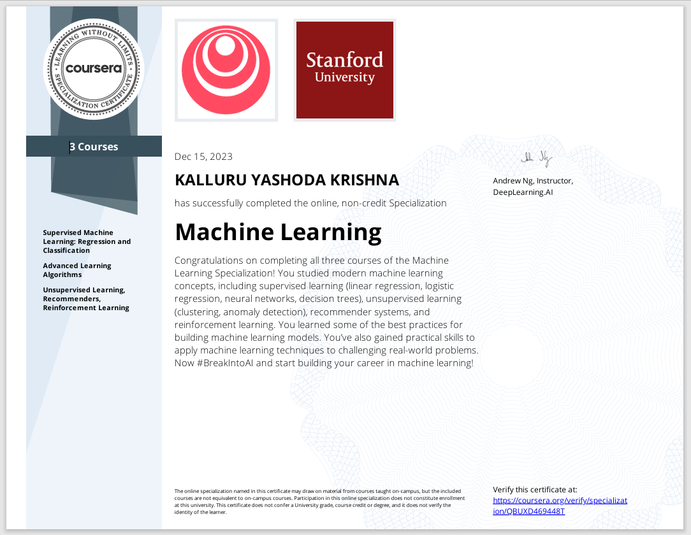
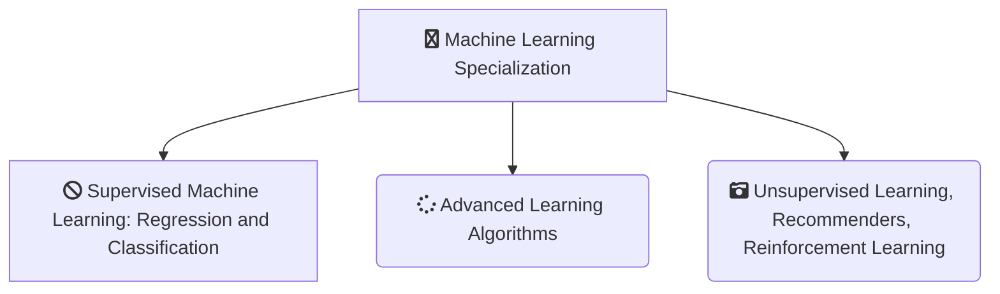

### ML-specilization

<h1 align="center">Collection of my writing and inspiration in ML and Software Engineering in Python</h1>

 

<i>A curated list of my writing and inspiration in Machine Learning and Software Engineering</i>

# Machine Learning Specialization on Coursera (`offered by deeplearning.ai`)

## Courses

The Machine Learning Specialization on Coursera contains three courses:

## About this Specialization

- The Machine Learning Specialization is a foundational online program created in collaboration between DeepLearning.AI and Stanford Online. This beginner-friendly program will teach you the fundamentals of machine learning and how to use these techniques to build real-world AI applications. 

- This Specialization is taught by Andrew Ng, an AI visionary who has led critical research at Stanford University and groundbreaking work at Google Brain, Baidu, and Landing.AI to advance the AI field.

- This 3-course Specialization is an updated version of Andrew’s pioneering Machine Learning course, rated 4.9 out of 5 and taken by over 4.8 million learners since it launched in 2012. 

- It provides a broad introduction to modern machine learning, including supervised learning (multiple linear regression, logistic regression, neural networks, and decision trees), unsupervised learning (clustering, dimensionality reduction, recommender systems), and some of the best practices used in Silicon Valley for artificial intelligence and machine learning innovation (evaluating and tuning models, taking a data-centric approach to improving performance, and more.)

- By the end of this Specialization, you will have mastered key concepts and gained the practical know-how to quickly and powerfully apply machine learning to challenging real-world problems. If you’re looking to break into AI or build a career in machine learning, the new Machine Learning Specialization is the best place to start.

## Applied Learning Project

By the end of this Specialization, you will be ready to:

 
- Build machine learning models in Python using popular machine learning libraries NumPy and scikit-learn.

- Build and train supervised machine learning models for prediction and binary classification tasks, including linear regression and logistic regression.

- Build and train a neural network with TensorFlow to perform multi-class classification.

- Apply best practices for machine learning development so that your models generalize to data and tasks in the real world.

- Build and use decision trees and tree ensemble methods, including random forests and boosted trees.

- Use unsupervised learning techniques for unsupervised learning: including clustering and anomaly detection.

- Build recommender systems with a collaborative filtering approach and a content-based deep learning method.

- Build a deep reinforcement learning model.

## Programming Assignments

### Course 1: Supervised Machine Learning: Regression and Classification
---

#### Week 2 : Practice lab: Linear regression 

### Week 3 : Practice lab: logistic regression

### Course 2: Advanced Learning Algorithms
---

#### Week 1 : Practice Lab: Neural Networks for Binary Classification

### Week 2 : Practice Lab: Neural Networks for Multiclass classification

### Week 3 : Practice Lab: Advice for Applying Machine Learning

### Week 4 : Practice lab: decision trees

### Course 3: Unsupervised Learning, Recommenders, Reinforcement Learning
---

### Week 1 : Practice Lab: KMeans

### Week 1 : Practice Lab: Anomaly Detection

### Week 2 : Practice Lab: Collaborative Filtering Recommender Systems

### Week 2 : Practice lab:Deep Learning for Content-Based Filtering

### Week 3 : Practice Lab: Reinforcement Learning

    
